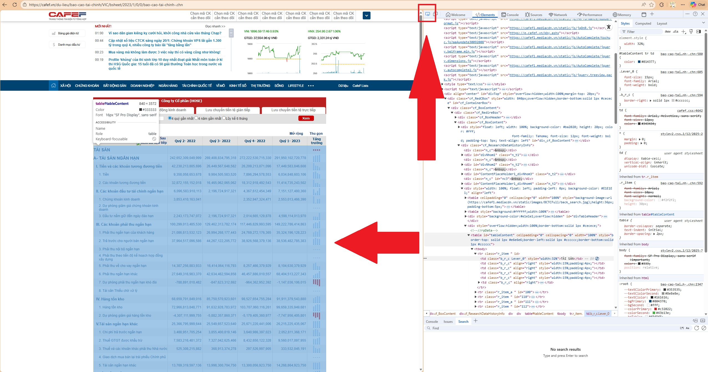

# HƯỚNG DẪN THỰC HÀNH  
## Crawl Báo Cáo Tài Chính Doanh Nghiệp (Balance Sheet)

## 1. Mục tiêu bài thực hành
Trong bài này, chúng ta sẽ thực hành:
- Crawl dữ liệu tài chính doanh nghiệp từ website công khai
- Làm việc với HTTP request bất đồng bộ (async)
- Phân tích HTML để trích xuất bảng dữ liệu
- Chuẩn hóa dữ liệu thành bảng (DataFrame)
- Xuất dữ liệu phục vụ phân tích nghiên cứu

---

## 2. Bối cảnh bài toán
Giả sử bạn đang tham gia một **nhóm nghiên cứu tài chính** và cần thu thập **báo cáo tài chính (Balance Sheet)** của nhiều doanh nghiệp niêm yết.

Nguồn dữ liệu được lấy từ website:
- Hiển thị báo cáo tài chính theo **mã cổ phiếu**
- Cho phép truy vấn theo **năm** và **quý**
- Dữ liệu được trình bày dưới dạng **bảng HTML**

Nhiệm vụ của bạn là:
- Tự động hóa việc thu thập dữ liệu từ [CafeF.vn](https://cafef.vn/du-lieu/bao-cao-tai-chinh/VIC/bsheet/2023/1/0/0/bao-cao-tai-chinh-.chn)
- Chuẩn hóa dữ liệu để phục vụ phân tích theo thời gian

---

## 3. Mô tả tổng quan chương trình
Chương trình thực hiện các bước chính sau:

1. Đọc danh sách mã cổ phiếu từ file (`stock.csv` hoặc `stock.xlsx`)
2. Với mỗi mã cổ phiếu:
   - Gửi request lấy báo cáo tài chính theo từng năm
   - Crawl dữ liệu từ bảng HTML
3. Gom dữ liệu của nhiều năm và nhiều doanh nghiệp
4. Xuất kết quả ra file Excel

---

## 4. Luồng xử lý dữ liệu
Luồng xử lý của chương trình có thể mô tả như sau:

1. Người dùng nhập:
   - Năm bắt đầu
   - Năm kết thúc
2. Chương trình tạo nhiều task async để:
   - Crawl dữ liệu từng năm
   - Crawl nhiều mã cổ phiếu song song
3. Mỗi trang HTML được:
   - Parse bằng BeautifulSoup
   - Trích xuất dữ liệu từng dòng trong bảng
4. Dữ liệu được gom lại thành bảng chuẩn
5. Kết quả được lưu ra file `balance_sheet.xlsx`

---

## 5. Cấu trúc dữ liệu thu thập
Mỗi dòng dữ liệu đại diện cho:
- Một chỉ tiêu tài chính
- Tại một thời điểm (năm)
- Của một doanh nghiệp

Các nhóm thông tin chính:
- Mã cổ phiếu
- Năm báo cáo
- Các chỉ tiêu tài chính trong bảng cân đối kế toán

Dữ liệu sau khi crawl có thể dùng để:
- So sánh doanh nghiệp theo thời gian
- Phân tích xu hướng tài chính
- Làm dữ liệu đầu vào cho các bài toán tài chính

---

## 6. Giải thích các thành phần chính trong code

### 6.1. Crawl dữ liệu theo năm
- Mỗi request tương ứng với **1 năm báo cáo**
- Dữ liệu được lấy từ bảng HTML (`<tr>` và `<td>`)
- Các chỉ tiêu tài chính được lưu dưới dạng key-value

### 6.2. Xử lý bất đồng bộ (Asynchronous)
- Nhiều request được gửi cùng lúc để tiết kiệm thời gian
- Giới hạn số kết nối nhằm tránh quá tải server
- Có cơ chế retry khi request thất bại

### 6.3. Chuẩn hóa dữ liệu
- Dữ liệu được gom vào DataFrame
- Thực hiện “expand” dữ liệu theo năm
- Loại bỏ các dòng dữ liệu không hợp lệ

---

## 7. Cách sử dụng chương trình
1. Chuẩn bị file:
   - `stock.csv` **hoặc** `stock.xlsx`
   - Cột bắt buộc: `stock`
2. Chạy chương trình
3. Nhập:
   - Năm bắt đầu
   - Năm kết thúc
4. Kiểm tra file kết quả:
   - `balance_sheet.xlsx`

---

## 8. Kết quả đầu ra
- File Excel chứa dữ liệu balance sheet
- Dữ liệu có thể sử dụng cho:
  - Phân tích tài chính
  - Vẽ biểu đồ
  - So sánh doanh nghiệp

---

## 9. Gợi ý thảo luận sau bài thực hành
- Ưu điểm của crawl bất đồng bộ so với tuần tự
- Rủi ro khi crawl dữ liệu web tài chính
- Cách mở rộng để crawl thêm:
  - Báo cáo KQKD
  - Lưu chuyển tiền tệ
  - Theo quý thay vì theo năm

---

## Hướng dẫn phân tích URL để crawl dữ liệu báo cáo tài chính

### 1. Quan sát URL nguồn dữ liệu
Xét URL sau:

https://cafef.vn/du-lieu/bao-cao-tai-chinh/VIC/bsheet/2023/1/0/0/bao-cao-tai-chinh-.chn

URL này được sử dụng để hiển thị **báo cáo tài chính** của một doanh nghiệp cụ thể trên website.

---

### 2. Phân tách cấu trúc URL
URL có thể được chia thành các phần:

- Domain:
  - `https://cafef.vn`

- Path:
  - `/du-lieu/bao-cao-tai-chinh/VIC/bsheet/2023/1/0/0/bao-cao-tai-chinh-.chn`

---

### 3. Xác định các tham số động trong URL
Quan sát kỹ phần path, ta thấy URL chứa nhiều thành phần có thể thay đổi:

| Vị trí | Giá trị | Ý nghĩa |
|------|--------|--------|
| `VIC` | Mã cổ phiếu | Doanh nghiệp cần lấy dữ liệu |
| `bsheet` | Loại báo cáo | Balance Sheet (Bảng cân đối kế toán) |
| `2023` | Năm | Năm báo cáo |
| `1` | Quý | Quý báo cáo |
| `0` | Tham số hệ thống | Mặc định |
| `0` | Tham số hệ thống | Mặc định |

Nhận xét:
- Thay đổi **mã cổ phiếu** → dữ liệu doanh nghiệp khác
- Thay đổi **năm / quý** → dữ liệu theo thời gian khác

---

### 4. Suy luận quy luật URL
Từ quan sát, có thể suy ra khuôn mẫu URL:

https://cafef.vn/du-lieu/bao-cao-tai-chinh/{SYMBOL}/{REPORT_TYPE}/{YEAR}/{QUARTER}/0/0/bao-cao-tai-chinh-.chn

Trong đó:
- `{SYMBOL}`: mã cổ phiếu (VIC, VNM, FPT, ...)
- `{REPORT_TYPE}`: loại báo cáo (`bsheet`, `kqkd`, `cashflow`)
- `{YEAR}`: năm báo cáo
- `{QUARTER}`: quý (1–4)

---

### 5. Kiểm chứng giả thuyết
Các bạn cần tự kiểm chứng bằng cách:
- Thay đổi `{SYMBOL}` sang mã khác
- Thay đổi `{YEAR}` hoặc `{QUARTER}`
- Quan sát xem trang có tải được dữ liệu hay không

Ví dụ:
- Thử đổi `VIC` → `VNM`
- Thử đổi `2023` → `2022`
- Thử đổi `1` → `2`

---

### 6. Ứng dụng vào việc viết chương trình
Sau khi xác định được khuôn mẫu URL, chương trình crawl có thể:
- Dùng vòng lặp để thay đổi năm
- Dùng danh sách mã cổ phiếu để crawl nhiều doanh nghiệp
- Tự động tạo URL thay vì truy cập thủ công

---

### 7. Câu hỏi gợi ý cho các bạn
- Nếu đổi quý mà không có dữ liệu, điều gì xảy ra?
- Có phải doanh nghiệp nào cũng có dữ liệu cho mọi năm?
- Làm sao để chương trình không bị lỗi khi trang trả về dữ liệu rỗng?
- Vì sao không nên gửi quá nhiều request cùng lúc?

---

### 8. Sử dụng DevTools để phân tích cấu trúc HTML



Để xác định chính xác vị trí dữ liệu trong trang web:

1. Mở **Developer Tools** (F12 hoặc Right-click → Inspect)
2. Click vào nút **"Select an element in page to inspect it"** (hoặc Ctrl+Shift+C)
3. Di chuột đến bảng dữ liệu trên trang web
4. Click vào phần tử cần crawl

Khi đó, DevTools sẽ:
- Highlight phần tử HTML tương ứng trong tab Elements
- Hiển thị cấu trúc thẻ HTML (`<table>`, `<tr>`, `<td>`)
- Cho phép copy selector hoặc XPath

**Lợi ích:**
- Xác định chính xác tag HTML chứa dữ liệu
- Tìm class hoặc id để parse dữ liệu
- Hiểu cấu trúc DOM để viết code crawl chính xác

---

## PHỤ LỤC: Chi tiết cài đặt và triển khai code

### A. Cấu trúc thư mục dự án
```
ex1/
├── code/
│   ├── balance_sheet.py    # File chính chứa logic crawl
│   └── requirements.txt     # Danh sách thư viện cần thiết
├── images/
│   ├── locate_elements.jpg
│   └── URL.jpg
├── stock.csv               # Danh sách mã cổ phiếu (tạo thủ công)
└── README.md
```

---

### B. Hướng dẫn cài đặt môi trường

#### B.1. Cài đặt Python
- Yêu cầu: Python 3.8 trở lên
- Kiểm tra: `python --version`

#### B.2. Tạo môi trường ảo (khuyến nghị)
```bash
# Tạo virtual environment
python -m venv venv

# Kích hoạt
# Windows:
venv\Scripts\activate
# Linux/Mac:
source venv/bin/activate
```

#### B.3. Cài đặt thư viện
```bash
cd code
pip install -r requirements.txt
```

---

### C. Chuẩn bị dữ liệu đầu vào

#### Tạo file `stock.csv`
```csv
stock
VIC
VNM
FPT
HPG
VCB
```

Hoặc file `stock.xlsx` với cột `stock` chứa danh sách mã cổ phiếu.

---

### D. Giải thích chi tiết code

#### D.1. Hàm `extract_year()` - Crawl dữ liệu 1 năm

```python
@retry(stop=stop_after_attempt(3), wait=wait_exponential(multiplier=1, min=2, max=10))
async def extract_year(symbol: str, year: int, quarter: int, session: aiohttp.ClientSession) -> dict:
```

**Chức năng:**
- Crawl dữ liệu balance sheet cho 1 năm cụ thể
- Tự động retry tối đa 3 lần nếu thất bại
- Thời gian chờ giữa các lần retry tăng theo cấp số mũ (2s, 4s, 8s)

**Các bước xử lý:**
1. Tạo URL động từ symbol, year, quarter
2. Gửi HTTP GET request bằng aiohttp
3. Parse HTML bằng BeautifulSoup
4. Tìm tất cả các thẻ `<tr>` có class `r_item` hoặc `r_item_a`
5. Trích xuất text từ các `<td>` trong mỗi dòng
6. Lưu vào dictionary với key là tên chỉ tiêu, value là list giá trị

**Ví dụ dữ liệu trả về:**
```python
{
    "A- TÀI SẢN NGẮN HẠN": ["1234567", "2345678", "3456789", "4567890"],
    "Tiền và tương đương tiền": ["123456", "234567", "345678", "456789"],
    "Year": ["2020", "2021", "2022", "2023"]
}
```

---

#### D.2. Hàm `get_years()` - Trích xuất năm

```python
def get_years(soup: BeautifulSoup) -> list:
    years = soup.find_all("td", class_="h_t")
    return [year.get_text(strip=True) for year in years]
```

**Chức năng:**
- Tìm các thẻ `<td>` có class `h_t` (header time)
- Trích xuất text và loại bỏ khoảng trắng
- Trả về list các năm

---

#### D.3. Hàm `fetch_and_expand_data()` - Crawl nhiều năm song song

```python
async def fetch_and_expand_data(symbol: str, start_year: int, end_year: int) -> pd.DataFrame:
```

**Cấu hình connection:**
```python
timeout = aiohttp.ClientTimeout(total=300)  # Timeout 5 phút
connector = aiohttp.TCPConnector(limit=50)   # Giới hạn 50 kết nối đồng thời
```

**Tạo tasks bất đồng bộ:**
```python
tasks = []
for year in range(start_year, end_year + 1):
    tasks.append(extract_year(symbol, year, 1, session))
```

**Chạy song song:**
```python
data_list = await asyncio.gather(*tasks, return_exceptions=True)
```
- `*tasks`: Unpack list thành nhiều arguments
- `return_exceptions=True`: Không dừng khi có lỗi, trả về Exception object

**Chuẩn hóa dữ liệu:**
```python
df = pd.DataFrame(dict(result))
expanded_df = df.explode(list(df.columns.difference(["Year"])))
```
- `explode()`: Mở rộng list values thành nhiều dòng riêng biệt
- Giữ nguyên cột `Year`, explode các cột còn lại

---

#### D.4. Hàm `create_df_from_symbol()` - Tạo DataFrame cho 1 mã

```python
async def create_df_from_symbol(symbol: str, start_year: int, end_year: int) -> pd.DataFrame:
```

**Xử lý:**
1. Gọi `fetch_and_expand_data()` để lấy dữ liệu
2. Thêm cột `stock` với giá trị là mã cổ phiếu
3. Lọc dữ liệu: chỉ giữ các dòng có "A- TÀI SẢN NGẮN HẠN" không rỗng
4. Xử lý exception và trả về DataFrame rỗng nếu có lỗi

**Lý do lọc dữ liệu:**
- Loại bỏ các dòng header hoặc dòng trống
- Đảm bảo chỉ lấy dữ liệu hợp lệ

---

#### D.5. Hàm `main()` - Luồng chính

**Bước 1: Đọc danh sách mã cổ phiếu**
```python
for f in files:
    if f == "stock.csv" or f == "stock.xlsx":
        if f.endswith(".xlsx"):
            symbols = pd.read_excel(f)["stock"].tolist()
        else:
            symbols = pd.read_csv(f)["stock"].tolist()
```

**Bước 2: Nhận input từ user**
```python
year_start = int(input("Enter start year: "))
year_end = int(input("Enter end year: "))
```

**Bước 3: Tạo tasks cho tất cả mã cổ phiếu**
```python
tasks = [create_df_from_symbol(s, year_start, year_end) for s in symbols]
data_frames = await asyncio.gather(*tasks)
```

**Bước 4: Gom dữ liệu và xuất Excel**
```python
data = pd.concat(data_frames)
cols = ["stock", "Year"] + [col for col in data.columns if col not in ["stock", "Year"]]
data = data[cols]
data.to_excel("balance_sheet.xlsx", index=False)
```

---

### E. Thư viện sử dụng (requirements.txt)

| Thư viện | Phiên bản | Mục đích sử dụng |
|----------|-----------|------------------|
| `aiohttp` | 3.13.3 | HTTP client bất đồng bộ, gửi nhiều request song song |
| `beautifulsoup4` | 4.14.3 | Parse HTML, trích xuất dữ liệu từ thẻ HTML |
| `pandas` | 2.3.3 | Xử lý dữ liệu dạng bảng, DataFrame |
| `openpyxl` | 3.1.5 | Đọc/ghi file Excel (.xlsx) |
| `tenacity` | 9.1.2 | Retry mechanism, tự động thử lại khi lỗi |
| `asyncio` | Built-in | Hỗ trợ lập trình bất đồng bộ async/await |

---

### F. Kỹ thuật quan trọng cần hiểu

#### F.1. Async/Await Pattern

**Cách truyền thống (tuần tự):**
```python
# Mất rất nhiều thời gian
for year in range(2020, 2024):
    data = extract_year("VIC", year)  # Chờ từng request
```

**Với async/await (song song):**
```python
# Nhanh hơn nhiều lần
tasks = [extract_year("VIC", year) for year in range(2020, 2024)]
data_list = await asyncio.gather(*tasks)  # Tất cả chạy cùng lúc
```

**Lợi ích:**
- Tiết kiệm thời gian: 10 request mất ~2s thay vì 20s
- Tận dụng thời gian chờ network

---

#### F.2. Error Handling Strategy

**Retry Decorator:**
```python
@retry(stop=stop_after_attempt(3), wait=wait_exponential(multiplier=1, min=2, max=10))
```
- Thử lại 3 lần
- Chờ 2s → 4s → 8s giữa các lần thử
- Tự động xử lý lỗi network tạm thời

**Exception Handling:**
```python
data_list = await asyncio.gather(*tasks, return_exceptions=True)

for d in data_list:
    if isinstance(d, Exception):
        print(f"Error: {d}")
        continue
```
- Không dừng chương trình khi 1 request lỗi
- In thông báo lỗi và tiếp tục xử lý request khác

---

#### F.3. Connection Management

```python
timeout = aiohttp.ClientTimeout(total=300)
connector = aiohttp.TCPConnector(limit=50)
```

**Lý do cần giới hạn:**
- Tránh quá tải server nguồn
- Tránh bị chặn IP do quá nhiều request
- Quản lý tài nguyên hệ thống (memory, file descriptors)

---

### G. Cách chạy chương trình

```bash
# 1. Di chuyển vào thư mục code
cd code

# 2. Chạy chương trình
python balance_sheet.py

# 3. Nhập năm bắt đầu (ví dụ: 2020)
Enter start year: 2020

# 4. Nhập năm kết thúc (ví dụ: 2023)
Enter end year: 2023

# 5. Chờ chương trình crawl và xuất file
# Kết quả: balance_sheet.xlsx
```

---

### H. Ví dụ kết quả đầu ra

File `balance_sheet.xlsx` sẽ có cấu trúc:

| stock | Year | A- TÀI SẢN NGẮN HẠN | Tiền và tương đương tiền | ... |
|-------|------|---------------------|-------------------------|-----|
| VIC   | 2020 | 12345678900        | 1234567890             | ... |
| VIC   | 2021 | 23456789000        | 2345678900             | ... |
| VNM   | 2020 | 3456789000         | 345678900              | ... |
| VNM   | 2021 | 4567890000         | 456789000              | ... |

---

### I. Troubleshooting - Xử lý lỗi thường gặp

#### Lỗi 1: Module not found
```
ModuleNotFoundError: No module named 'aiohttp'
```
**Giải pháp:** `pip install -r requirements.txt`

#### Lỗi 2: File stock.csv không tìm thấy
```
Error reading stock symbols file!
```
**Giải pháp:** Tạo file `stock.csv` trong cùng thư mục với code

#### Lỗi 3: Timeout error
```
TimeoutError: Total timeout limit reached
```
**Giải pháp:** 
- Tăng timeout: `ClientTimeout(total=600)`
- Giảm số kết nối đồng thời: `TCPConnector(limit=20)`

#### Lỗi 4: Dữ liệu rỗng
**Nguyên nhân:**
- Website thay đổi cấu trúc HTML
- Mã cổ phiếu không tồn tại
- Năm không có dữ liệu

**Giải pháp:**
- Kiểm tra lại URL trên trình duyệt
- Sử dụng DevTools để xem cấu trúc HTML mới
- Cập nhật selector trong code

---

### J. Bài tập mở rộng

1. **Crawl thêm báo cáo khác:** KQKD (income statement), Cash Flow
2. **Thêm progress bar:** Hiển thị tiến độ crawl bằng `tqdm`
3. **Lưu database:** Thay vì Excel, lưu vào SQLite hoặc PostgreSQL
4. **Xử lý duplicate:** Kiểm tra và xóa dữ liệu trùng lặp
5. **Schedule tự động:** Dùng `schedule` để crawl định kỳ mỗi ngày

---

### K. Tài liệu tham khảo

- [aiohttp Documentation](https://docs.aiohttp.org/)
- [BeautifulSoup Documentation](https://www.crummy.com/software/BeautifulSoup/bs4/doc/)
- [Pandas Documentation](https://pandas.pydata.org/docs/)
- [Python asyncio](https://docs.python.org/3/library/asyncio.html)
- [Tenacity Retry](https://tenacity.readthedocs.io/)